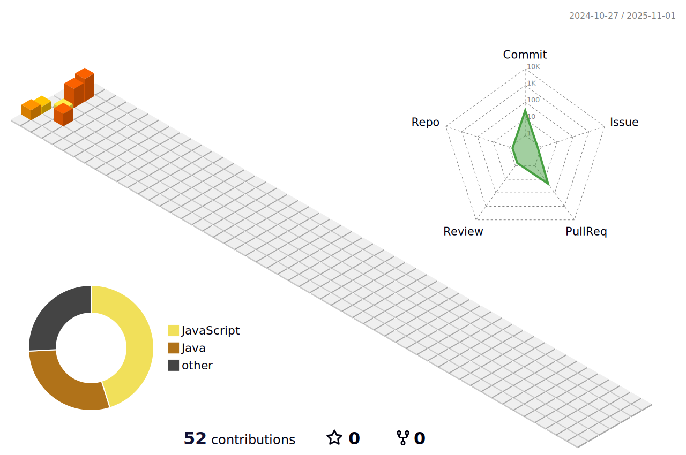

<h1 align="center">Hi 👋, I'm PARK WOOIN</h1>
<h3 align="center">IT 개발 지망생</h3>

  

  

 

<h3 align="center">Connect with me</h3>

  
  <h4 align="center" type="link">wooinp92@gmail.com</h4>
  <h4 align="center" type="link">https://url.kr/4a1izt</h4>

 

<h3 align="center">Languages and Tools</h3>

	<code></code>
	<code></code>
	<code></code>
	<code></code>
 	<code></code>
  	<code></code>
   	<code></code>
    	<code></code>
	<code></code>	

	<code></code>
	<code></code>
	<code></code>
	<code></code>
	<code></code>
	<code></code>
	<code></code>
	<code></code>

 
 

<h3 align="center">Contributions</h3>

<!-- 3D 잔디 -->

 
 

<!-- 

	

	

-->
